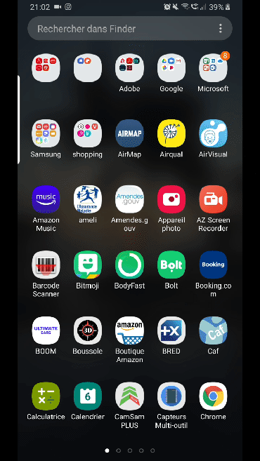

# Presentation
Simple Air Quality and weather android app, coded in Java.
It first locate your location whith your IP then you can choose a city to get wheather.
#


## requirements
- Install Android Studio
- clone the develop branch from the repository<br/>
````
https://github.com/sullixxx/Airqual.git
````

## Course instructions : 

- MVC Architecture
- Appels REST
- screen : 3 activity
- Display a list in a RecyclerView
- Display the detail of an element in an other activity
- Gitflow
- saving the country in cache (sharedpreference)

- Bonus features :
	- animation between activities
  - locating user on startup
  - display a snackbar on connection lost
  - gauge to display AQI (air quality index) and color change according to the value
  - floating action button to quickly go to closest city informations
  - loading an image from an url to illustrate current wheather (Picasso)

## Fonctionnality: 

### First screen 

- home screen to choose a state in the country your are located, then redirecting to a screen displaying the cities in the selected state.


### detail screen 

- Displaying city wheather.


